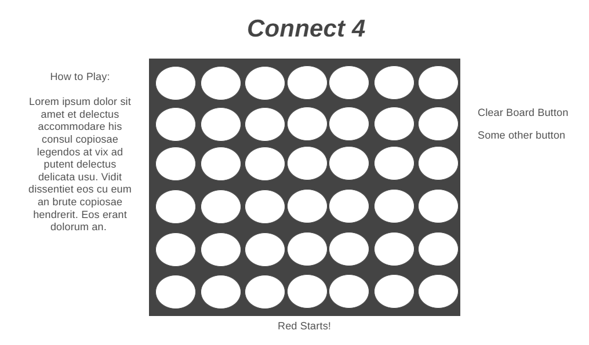
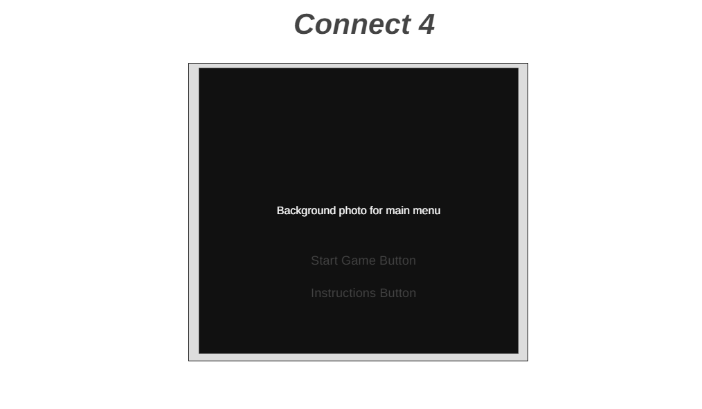

# Connect 4

SEBPT 220 Project 1: Connect 4

To play please visit <url>

## How To

### Install

Fork and clone this repository to your local machine.

Open index.html in your browser of choice.

Open the files in a text editor to view or modify code as you please.

### Play

Try to connect 4 pieces in a row before your opponent. You can win in any direction.

## How it Works

This game of Connect 4 is powered almost entirely by JavaScript functions and DOM manipulation.
The board is first created when the Start Game button is pressed. It loads in a grid of cells with 6 rows and 7 columns with each cell having an event listener waiting for it to be clicked so a function can be run. This function will also call the playerStart() function which selects a random number between 1-2 to determine who starts first. Here is part of the code from the makeBoard() and drawBoard() functions on how the board is made:

```ruby
for (let i = 0; i < columns; i++) {
        const column = [];
        for (let j = 0; j < rows; j++) {
            column.push(null); // Push empty cell
        }
        board.push(column); //push column to board

    }
    return board;

for (let i = 0; i < columns; i++) {
    const columnDiv = document.createElement("div");
    columnDiv.className = "column-div";

    for (let j = 0; j < rows; j++) {
        const cell = document.createElement("div");
        cell.className = "cell";
        cell.addEventListener("click", playPiece); //place down piece in cell when clicked
        columnDiv.append(cell);
    }
    boardDisplay.append(columnDiv);
}
```

This function then goes on to create the buttons on screen, but after that it calls the playPiece() function. Whenever a piece is placed, the playPiece() function is run to find the lowest empty cell in the column and update the piece in the grid. This function will also switch players as the piece is placed.

```ruby
function playPiece(e) {
    const clickedCell = e.currentTarget; //target clicked cell

    const index = Array.from(clickedCell.parentNode.parentNode.children).indexOf(
        clickedCell.parentNode
    );

    //find lowest cell
    let lowestCell;
    const columnCell = document.querySelectorAll(`.column-div:nth-child(${index + 1}) .cell`);

    for (let i = columnCell.length - 1; i >= 0; i--) {
        if (columnCell[i].childElementCount === 0) {
            lowestCell = columnCell[i]; //set lowest cell to the lowest empty cell in column index
            break;
        }
    }

    if (lowestCell) { // if lowest cell exists
        if (currentPlayer === playerOne) {
            const redCell = document.createElement("img");
            redCell.src = "./images/redcell.png";
            redCell.className = "red-cell";
            lowestCell.append(redCell);
            currentPlayer = playerTwo; // switch to playerTwo after placing the red piece
            document.getElementById("game-display").style.cursor =
                "url('./images/yellowcursor.png'), auto"; // Switch cursor to yellow for next turn
        } else if (currentPlayer === playerTwo) {
            const yellowCell = document.createElement("img");
            yellowCell.src = "./images/yellowcell.png";
            yellowCell.className = "yellow-cell";
            lowestCell.append(yellowCell);
            currentPlayer = playerOne; // switch to playerOne after placing the yellow piece
            document.getElementById("game-display").style.cursor =
                "url('./images/redcursor.png'), auto"; // Switch cursor to red for next turn
        }

        // update board array to fix error with winCheck
        // set row index equal to the index of lowest cell
        const indexRow = [...columnCell].indexOf(lowestCell);
        board[indexRow][index] = currentPlayer;

        turnCheck();
        winCheck();
        drawCheck();
    }
}
```

As you can see, this function calls a few others, but the main focus here is the winCheck() function. This function checks to see if any of the win conditions are hit, and if they do, it will update the gameOver variable to true and the displayWinner() function will pop up. The win conditions are 4 of the same coloured piece in a row in a horizontal, vertical, or diagonal direction. Here's a snippet from the winCheck() function showing horizontal wins and top left -> bottom right diagonal wins.

```ruby
function winCheck() {
    //check for horizontal wins
    for (let i = 0; i < rows; i++) {
        for (let j = 0; j < columns; j++) {
            if (
                board[i][j] === currentPlayer &&
            board[i][j + 1] === currentPlayer &&
                board[i][j + 2] === currentPlayer &&
                board[i][j + 3] === currentPlayer
            ) {
                gameOver = true;
                displayWinner();
                break;
            }
        }
    }


    //check for diagonal wins
    //top left to bottom right
    for (let i = 0; i < rows; i++) {
        for (let j = 0; j <= columns; j++) {
            if (
                board[i][j] === currentPlayer &&
                board[i + 1][j + 1] === currentPlayer &&
                board[i + 2][j + 2] === currentPlayer &&
                board[i + 3][j + 3] === currentPlayer
            ) {
                gameOver = true;
                displayWinner();
                break;
            }
        }
    }
}
```

If any of these conditions are hit, it will call the displayWinner() function which displays the winner on screen. If none of these conditions are hit and the board is full, it will call the displayDraw() function through the drawCheck() function at the same time as winCheck(). Both display[x]() functions basically do the same thing and will display a message on screen indication the game has ended, they just have different conditions that need to be met.

```ruby
function displayWinner() {
    const boardDisplay = document.getElementById("game-display");

    if (gameOver === true) {
        if (currentPlayer === 2) {
            currentPlayer = "Red";
            boardDisplay.style.cursor = "url('./images/gameoverred.png'), auto";
        } else if (currentPlayer === 1) {
            currentPlayer = "Yellow";
            boardDisplay.style.cursor = "url('./images/gameoveryellow.png'), auto";
        }
        const gameOverDiv = document.createElement("div");
        gameOverDiv.id = "game-over-div";

        const winnerText = document.createElement("h2");
        winnerText.id = "winner-text";
        winnerText.textContent = `Game Over! ${currentPlayer} has won!`;

        gameOverDiv.append(winnerText);
        boardDisplay.append(gameOverDiv);

        const cells = document.querySelectorAll(".cell");
        cells.forEach(function (cell) {
            cell.removeEventListener("click", playPiece); //remove event listener
        });

        const turnDisplay = document.getElementById("turn-div");
        turnDisplay.remove();
    }
}
```

And that is how this game functions()! When the game is over you can then start a new game by pressing the New Game button on screen which will reset/clear/remake the board, or you can go to the main menu by pressing Main Menu which will reload the page to clear all DOM manipulation and bring you back to the home screen.

## Future Considerations

I initially had Player VS. CPU in mind for this, but I never attempted to get that working. I would definitely like to give it a shot if I come back to this. Have no clue how I'd go about doing that right now unless the CPU just essentially copies moves, or does complete random ones but that wouldn't seem super challenging.

I had also planned to make the game change size for smaller view-width's, mainly to make it functional on a phone, but I couldn't get it working the way I wanted to. I feel like if I were to make this happen I'd just redo all of the CSS and I don't think this is a necessary feature right now.

Would also like to clean up the code a bit as I know for sure I re-used lines when they probably didn't need to be, or I could have just set up more variables outside of the function scope so they can all access them when needed. I feel like I was all over the place when I started this and didn't think everything through, but it was my first time making anything like this. If I were to redo this I would just change the order in which I did things, such as do the win conditions first as it took me an entire day to figure that out just for me to realize that headache could have been avoided by making my functions in a better order/actually thinking about the game logic properly. Making the board and detecting the win conditions like I did at first seems to have clashed and caused a bunch of errors that I had to troubleshoot.

## Wireframe

### First Draft



This was how the game first appeard in my head. Just a simple game board, title and instructions on the side with a couple of buttons.

This vision quickly changed once I realized this was probably going to look a little too busy once I added borders and colours.



I then thought of this, where you just start at a main menu with two button options. One takes you to the start of the game, which would look similar to the first draft, and the other would bring you to a screen similar to this one, but would display instructions as well within the main game display.

Everything else just kind of came to me as I was coding out the game becuase I wasn't sure at first what kind of features would be involved if any.

My main vision stayed in place, but made multiple additions.
